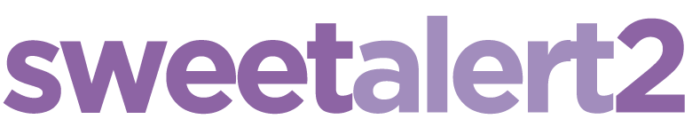
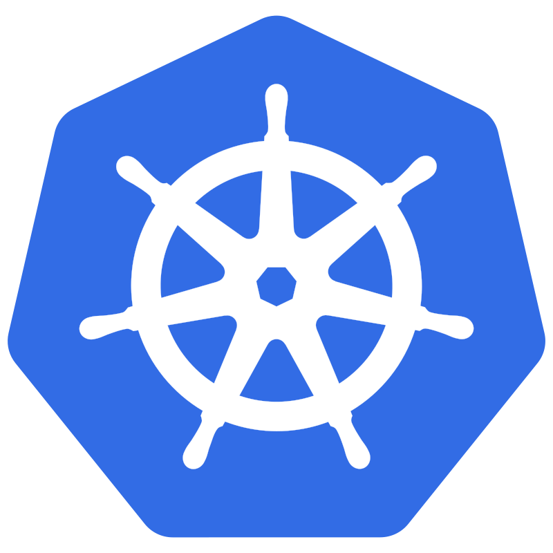

# 👋 Hi, I'm Natnicha Rodtong

**Backend Engineer | Cloud Enthusiast | Open-Source Contributor**  

I'm a passionate **Senior Backend Engineer** with **6+ years of experience** building **scalable, high-performance systems**. I love solving complex problems, working with distributed systems, and exploring new technologies that push the limits of what software can do.  

---

## 🌟 About Me

- 🎓 **Master’s Degree** in Informatik (Web Engineering), Technische Universität Chemnitz (Germany)
- 📚 **Bachelor's Degree** in Computer Engineering, Technische King Mongkut's University of Technology Thonburi (Thailand)
- 💻 **Specialties:** Backend Development, Microservices, Kubernetes
- ⚡ **Languages:**  Go, Python, Java, TypeScript
- 🌐 Fully **remote-work experienced** for 3+ years  
- 🚀 Passionate about building **impactful, user-centric applications**  

---

## 🛠 Skills & Tech Stack

 

---

## 🔥 Projects
### [✨Journi](https://github.com/natnicha/journi-web)
A modern, cross-platform web application that helps travelers effortlessly plan, organize, and visualize their trips. From mapping out multi-day itineraries to managing places, notes, and activities — Journi brings simplicity and structure to your travel planning experience.

### [🎓Kubernetes Auto Scaler - Master Thesis](https://github.com/natnicha/master-thesis-auto-scaler)  
Designed an **adaptive Kubernetes horizontal pod scaler** using **Reinforcement Learning**, combining research with real-world scalable systems.

### [⛅Photovoltaic System Application](https://github.com/natnicha/database-web-techniques-photovoltaic-system-app)
A web-based calculation system for a photovoltaic system with a specific manufacturer and product of your choice based on current weather data and local conditions.

### [🌈BeAcross](https://github.com/natnicha/BeAcross)  
An initiative platform connecting students from various European universities. I contributed as a **full-stack developer**, handling **backend with Python/FastAPI** and **frontend with React/TypeScript**. 

---

## 🌱 Interests

- Distributed Systems & Cloud Architecture  
- Open-Source Projects & Community Collaboration  
- Performance Optimization & Monitoring  
- UX-driven software design  
- AI & Machine Learning

---

## 📫 Let’s Connect

&nbsp;&nbsp;

&nbsp;&nbsp;

---

